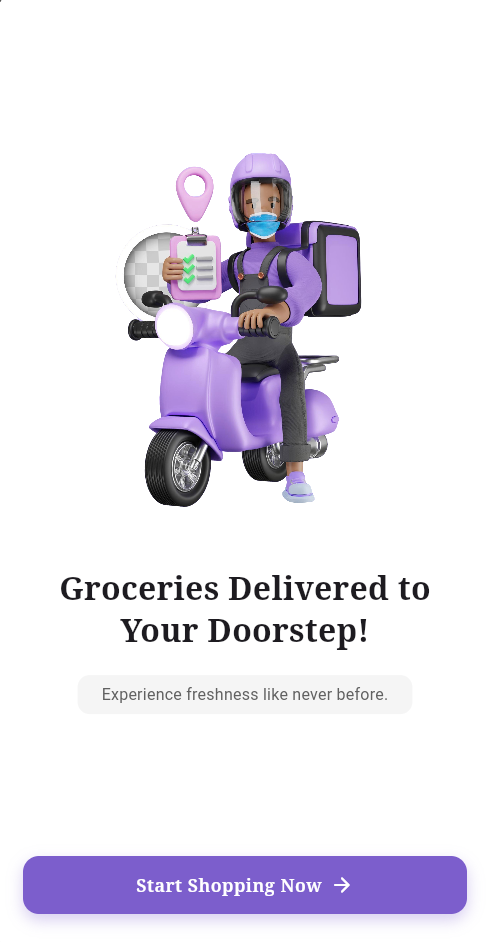
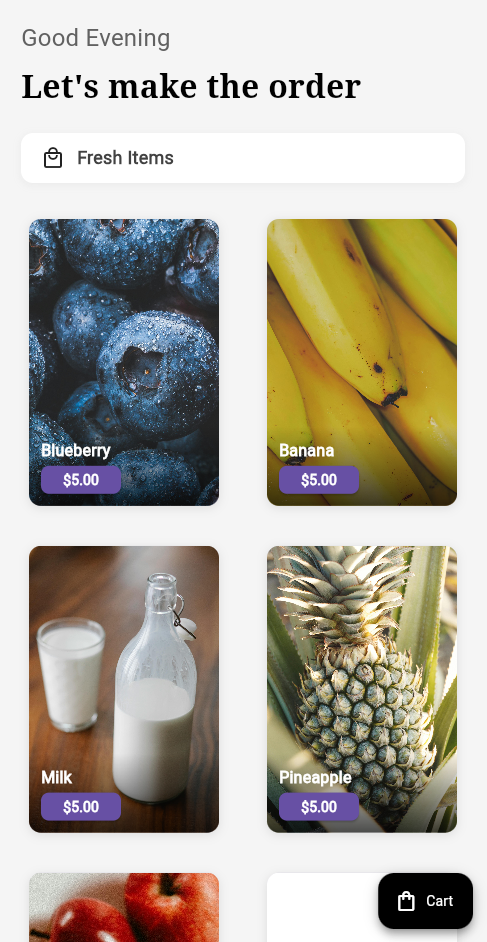
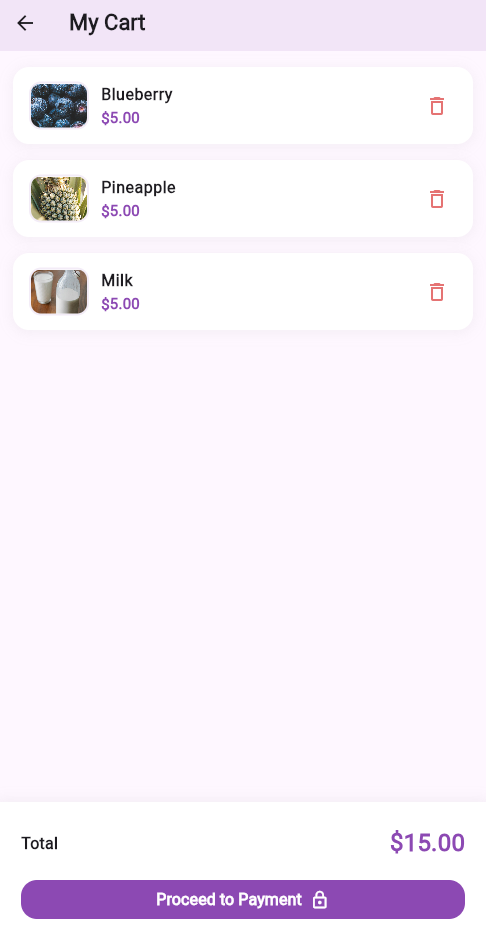

# ShopApp

A simple grocery shopping Flutter application with CRUD functionality, utilizing the Provider package for state management.

## Features

- Add, update, and delete grocery items (CRUD functionality).
- Intuitive UI for managing your grocery list.
- State management implemented using Provider.

## Screenshots

<div style="display: flex; justify-content: space-around; align-items: center;">
  
  
  
</div>

## Getting Started

This project is a starting point for a Flutter application.

### Prerequisites

Ensure you have the following installed:

- Flutter SDK
- Android Studio or Visual Studio Code with Flutter and Dart plugins

### Installation

1. Clone the repository:
   ```bash
   git clone https://github.com/yourusername/shopapp.git

### Installation

1. Clone the repository:
   ```bash
   git clone https://github.com/yourusername/shopapp.git
   ```
2. Navigate to the project directory:
   ```bash
   cd shopapp
   ```
3. Install dependencies:
   ```bash
   flutter pub get
   ```
4. Run the application:
   ```bash
   flutter run
   ```


## Resources

- [Flutter Documentation](https://docs.flutter.dev/)
- [Provider Package](https://pub.dev/packages/provider)

---

Feel free to contribute or provide feedback to improve this application!
